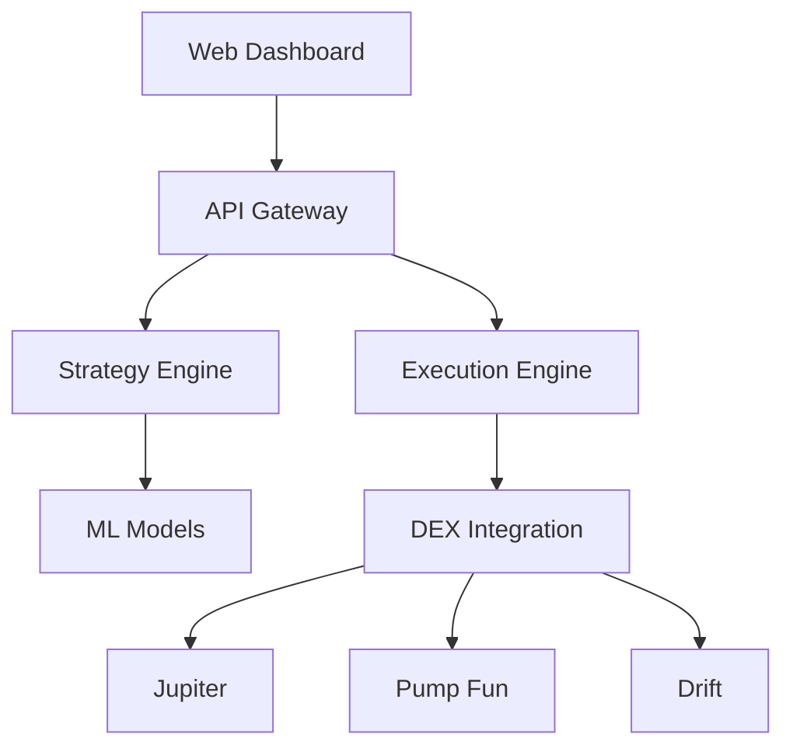

# AI-Powered Solana Trading Bot

[](https://github.com/project/ai-solana-trading-bot/actions)
[](https://codecov.io/gh/project/ai-solana-trading-bot)
[](https://snyk.io/test/github/project/ai-solana-trading-bot)
[](LICENSE)

A cutting-edge autonomous trading system designed for continuous operation across multiple Solana-based decentralized exchanges (DEXs). The system leverages artificial intelligence and machine learning to execute trades, manage risk, and adapt to changing market conditions without requiring constant user intervention.

## Key Features

- 🤖 AI/ML-driven strategy optimization
- 🔄 Multi-DEX coverage (Jupiter, Pump Fun, Drift)
- ⚡ High-speed execution with MEV optimization
- 🛡️ Comprehensive risk management
- 📊 Real-time performance analytics
- 🔒 Enterprise-grade security

## Prerequisites

- Rust 1.70+
- Python 3.11+
- TypeScript 5.0+
- Docker 24.0+
- AWS Account with required permissions
- Solana Wallet (Phantom recommended)
- Node.js 18.0+
- PostgreSQL 15+
- Redis 7.0+

## Installation

1. Clone the repository:
```bash
git clone https://github.com/project/ai-solana-trading-bot.git
cd ai-solana-trading-bot
```

2. Configure environment variables:
```bash
cp .env.example .env
# Edit .env with your configuration
```

3. Install dependencies:
```bash
# Python dependencies
pip install -r requirements.txt

# Node dependencies
npm install

# Rust dependencies
cargo build
```

4. Set up databases:
```bash
# Initialize PostgreSQL
psql -f scripts/init_db.sql

# Configure Redis
redis-cli CONFIG SET requirepass "your_password"
```

5. Deploy AWS infrastructure:
```bash
cd infrastructure
terraform init
terraform apply
```

## Usage

### Local Development

1. Start development environment:
```bash
docker-compose up -d
```

2. Run test suite:
```bash
make test
```

3. Start local services:
```bash
make run-dev
```

### Production Deployment

1. Configure AWS credentials:
```bash
aws configure
```

2. Deploy to production:
```bash
make deploy-prod
```

3. Monitor deployment:
```bash
make monitor
```

## Architecture



### Components

- **Strategy Engine**: Python-based ML system for trade optimization
- **Execution Engine**: Rust-powered high-performance trade execution
- **Data Collector**: Real-time market data aggregation
- **Risk Manager**: Automated position sizing and risk control
- **Web Dashboard**: React-based monitoring interface

## Security

- End-to-end encryption for sensitive data
- Multi-factor authentication
- Regular security audits
- Automated vulnerability scanning
- See [SECURITY.md](SECURITY.md) for details

## Contributing

Please read [CONTRIBUTING.md](CONTRIBUTING.md) for details on our code of conduct and development process.

## License

This project is licensed under the MIT License - see the [LICENSE](LICENSE) file for details.

## Support

- Documentation: [docs.project.com](https://docs.project.com)
- Issues: [GitHub Issues](https://github.com/project/ai-solana-trading-bot/issues)
- Security: [SECURITY.md](SECURITY.md)

## Acknowledgments

- Solana Foundation
- Jupiter Exchange
- Jito Labs
- Open-source community

---

⚠️ **Disclaimer**: Trading cryptocurrencies carries significant risk. This software is provided "as is" without warranty. Use at your own risk.