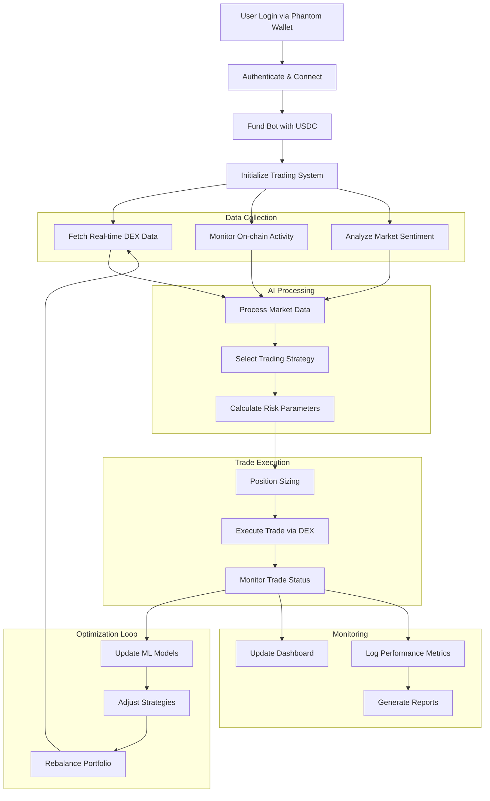
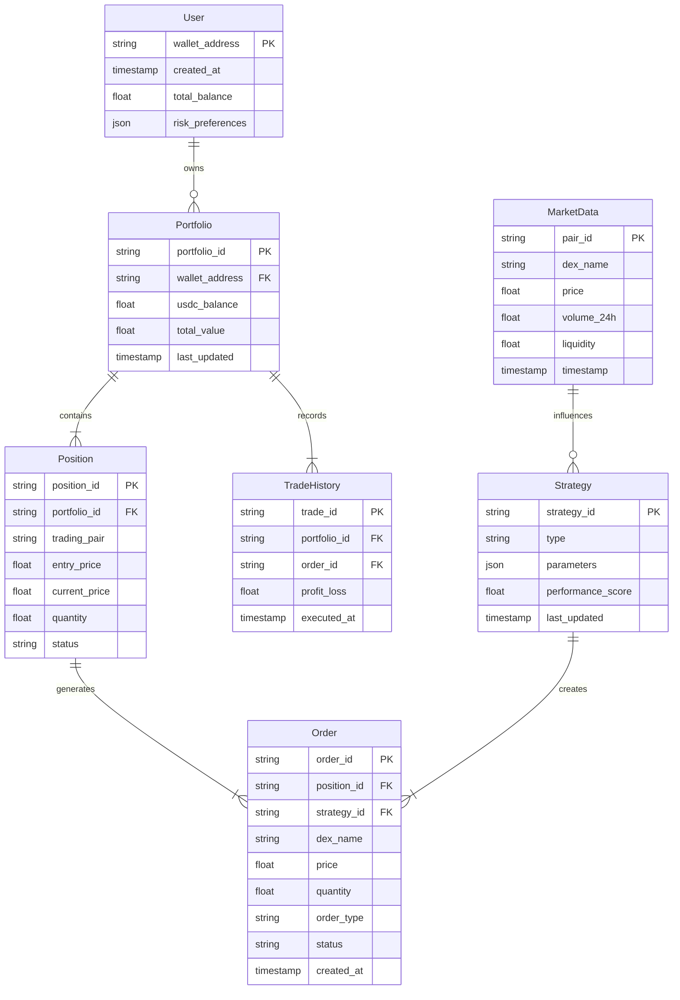
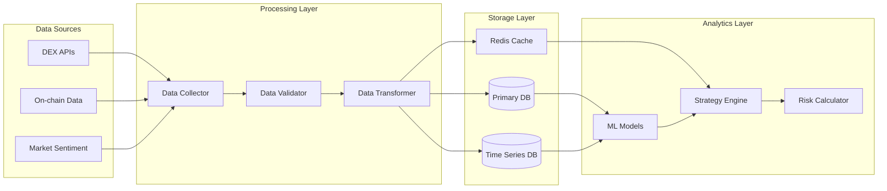

# Product Requirements Document (PRD)

# 1. INTRODUCTION

## 1.1 Purpose
This Software Requirements Specification (SRS) document provides a comprehensive description of the AI-Powered Solana Trading Bot. It details the functional and non-functional requirements for developers, stakeholders, and QA teams involved in the development process. The document serves as the primary reference for technical implementation and validation of the trading bot system.

## 1.2 Scope
The AI-Powered Solana Trading Bot is an autonomous cryptocurrency trading system that operates across multiple Solana-based decentralized exchanges (DEXs). The system encompasses:

- Real-time data collection and analysis from multiple DEXs (Jupiter, Pump Fun, Drift)
- AI/ML-driven trading strategy selection and execution
- Automated risk management and portfolio optimization
- Web-based monitoring dashboard with wallet authentication
- Integration with Solana blockchain for high-speed trading

Key benefits include:
- Fully autonomous 24/7 trading operation
- Self-optimizing strategies using reinforcement learning
- Multi-DEX coverage for enhanced profit opportunities
- Sub-second trade execution leveraging Solana's infrastructure
- Automated risk management and position sizing

Out of scope:
- Manual trading capabilities
- Support for non-Solana blockchains
- Social trading features
- Mobile applications
- Customer support system

# 2. PRODUCT DESCRIPTION

## 2.1 Product Perspective
The AI-Powered Solana Trading Bot operates as an autonomous system within the broader Solana DeFi ecosystem. It interfaces with:

- Multiple Solana DEXs (Jupiter, Pump Fun, Drift) for trade execution
- Solana blockchain for transaction processing and on-chain data
- Jito Labs MEV infrastructure for optimized trade routing
- Cloud infrastructure (AWS Singapore) for system operation
- Web browsers for dashboard access

## 2.2 Product Functions
The system provides the following core functions:

- Autonomous trading strategy selection and execution
- Multi-DEX real-time data collection and analysis
- AI/ML-driven portfolio optimization
- Automated risk management and position sizing
- Performance monitoring and reporting
- Wallet-based authentication and fund management
- Historical trade tracking and analysis
- Strategy refinement through reinforcement learning

## 2.3 User Characteristics
Target users are advanced cryptocurrency traders with the following attributes:

| Characteristic | Description |
|---------------|-------------|
| Technical Expertise | High understanding of DeFi, trading, and cryptocurrency markets |
| Risk Tolerance | Medium to high, with capital available for algorithmic trading |
| Time Availability | Limited; prefer automated solutions over active trading |
| Investment Goals | Seeking consistent returns through algorithmic strategies |
| Platform Experience | Familiar with Solana ecosystem and wallet management |

## 2.4 Constraints

Technical Constraints:
- Must operate within Solana's transaction processing limits
- Limited to DEXs available on Solana blockchain
- Dependent on API availability and rate limits of integrated DEXs
- Transaction latency bounded by blockchain confirmation times

Operational Constraints:
- AWS Singapore region infrastructure requirements
- 99.9% minimum uptime requirement
- Sub-second trade execution requirements
- Single-user authentication limitation

## 2.5 Assumptions and Dependencies

Assumptions:
- Users have sufficient technical knowledge to fund and monitor the bot
- Solana network remains stable and operational
- DEX APIs maintain consistent interfaces and functionality
- Market conditions allow for profitable trading opportunities

Dependencies:
- Solana blockchain network availability
- Jupiter, Pump Fun, and Drift DEX operational status
- Jito Labs MEV infrastructure functionality
- AWS cloud services availability
- Phantom wallet integration capabilities
- Real-time market data feeds reliability

# 3. PROCESS FLOWCHART

# 4. FUNCTIONAL REQUIREMENTS

## 4.1 Data Collection and Analysis

| ID | Description | Priority |
|---|---|---|
| F1.1 | Real-time price data collection from Jupiter, Pump Fun, and Drift DEXs | High |
| F1.2 | On-chain activity monitoring for whale movements and liquidity changes | High |
| F1.3 | Market sentiment analysis across Solana ecosystem | Medium |
| F1.4 | Trading pair opportunity scanning and evaluation | High |
| F1.5 | Historical data aggregation and storage | Medium |

## 4.2 AI/ML Trading Strategy

| ID | Description | Priority |
|---|---|---|
| F2.1 | Dynamic strategy selection using ML models | High |
| F2.2 | Reinforcement learning for strategy optimization | High |
| F2.3 | Real-time strategy adaptation based on market conditions | High |
| F2.4 | Multi-DEX arbitrage opportunity detection | Medium |
| F2.5 | Automated trading pair selection and USDC conversion | High |

## 4.3 Trade Execution

| ID | Description | Priority |
|---|---|---|
| F3.1 | Sub-second trade execution across multiple DEXs | High |
| F3.2 | MEV-optimized transaction routing via Jito Labs | Medium |
| F3.3 | Smart order routing across available DEXs | High |
| F3.4 | Transaction monitoring and confirmation tracking | High |
| F3.5 | Failed transaction handling and recovery | High |

## 4.4 Risk Management

| ID | Description | Priority |
|---|---|---|
| F4.1 | Dynamic position sizing based on market volatility | High |
| F4.2 | Automated stop-loss and take-profit adjustment | High |
| F4.3 | Portfolio exposure monitoring and rebalancing | High |
| F4.4 | Risk limit enforcement and emergency shutdown | High |
| F4.5 | Liquidity analysis and slippage protection | Medium |

## 4.5 User Interface and Monitoring

| ID | Description | Priority |
|---|---|---|
| F5.1 | Phantom wallet authentication and connection | High |
| F5.2 | Real-time performance metrics dashboard | High |
| F5.3 | Trade history and analytics reporting | Medium |
| F5.4 | Portfolio balance and ROI tracking | High |
| F5.5 | System status and health monitoring | Medium |

## 4.6 System Administration

| ID | Description | Priority |
|---|---|---|
| F6.1 | Automated system backup and recovery | High |
| F6.2 | Performance logging and error tracking | High |
| F6.3 | API key and sensitive data encryption | High |
| F6.4 | System resource monitoring and scaling | Medium |
| F6.5 | Database maintenance and optimization | Medium |

# 5. NON-FUNCTIONAL REQUIREMENTS

## 5.1 Performance

| Requirement | Description | Target Metric |
|------------|-------------|---------------|
| Response Time | Maximum latency for trade execution | < 500ms |
| API Processing | Time to process incoming market data | < 100ms |
| Transaction Throughput | Number of concurrent trades | 1000+ per second |
| Memory Usage | Maximum RAM utilization | < 8GB per instance |
| CPU Utilization | Average CPU load | < 70% |
| Network Latency | Maximum network delay to DEXs | < 50ms |
| Database Performance | Query response time | < 100ms |

## 5.2 Safety

| Requirement | Description | Implementation |
|------------|-------------|----------------|
| Failover Protection | Automatic system shutdown on critical errors | Circuit breaker triggers |
| Data Backup | Regular backup of critical system data | Every 6 hours |
| Fund Protection | Maximum loss limits per trade | 2% of portfolio value |
| Error Recovery | Automatic recovery from non-critical failures | Self-healing mechanisms |
| State Management | Transaction atomicity and consistency | Roll-back capabilities |
| Emergency Shutdown | Graceful system shutdown protocol | < 30 seconds completion |

## 5.3 Security

| Requirement | Description | Standard |
|------------|-------------|-----------|
| Authentication | Phantom wallet-based user authentication | Web3 standards |
| Authorization | Role-based access control | AWS IAM |
| Data Encryption | AES-256 encryption for sensitive data | FIPS 140-2 |
| API Security | Rate limiting and request validation | OAuth 2.0 |
| Network Security | TLS 1.3 for all communications | SSL/TLS |
| Key Management | Secure storage of API keys and credentials | AWS KMS |
| Audit Logging | Comprehensive security event logging | CloudWatch |

## 5.4 Quality

### 5.4.1 Availability
- System uptime: 99.9% (excluding planned maintenance)
- Maximum planned downtime: 4 hours per month
- Recovery Time Objective (RTO): < 15 minutes
- Recovery Point Objective (RPO): < 5 minutes

### 5.4.2 Maintainability
- Code documentation coverage: > 90%
- Automated test coverage: > 85%
- Maximum time for critical bug fixes: < 4 hours
- Regular system updates: Weekly deployment window

### 5.4.3 Usability
- Dashboard load time: < 2 seconds
- Maximum clicks to key functions: ≤ 3
- Real-time data refresh rate: Every 1 second
- Browser compatibility: Chrome, Firefox, Safari (latest versions)

### 5.4.4 Scalability
- Horizontal scaling capability: Up to 10 instances
- Data storage scalability: Up to 1TB
- User session handling: Up to 100 concurrent sessions
- API scalability: 10,000 requests per minute

### 5.4.5 Reliability
- Mean Time Between Failures (MTBF): > 720 hours
- Mean Time To Repair (MTTR): < 30 minutes
- Error rate threshold: < 0.1% of transactions
- Data consistency check frequency: Every 5 minutes

## 5.5 Compliance

| Requirement | Description | Standard |
|------------|-------------|-----------|
| Data Protection | User data handling and storage | GDPR |
| Financial Compliance | Trading operations and reporting | MiFID II |
| Cryptocurrency Regulations | Digital asset trading compliance | FinCEN guidelines |
| Infrastructure Security | Cloud security standards | ISO 27001 |
| Code Quality | Development standards | OWASP Top 10 |
| API Standards | RESTful API implementation | OpenAPI 3.0 |
| Blockchain Compliance | Solana network transaction standards | Solana protocols |

# 6. DATA REQUIREMENTS

## 6.1 Data Models

## 6.2 Data Storage

### 6.2.1 Primary Storage
- PostgreSQL database cluster for transactional data
- TimescaleDB extension for time-series market data
- Redis for real-time caching and session management

### 6.2.2 Data Retention
| Data Type | Retention Period | Storage Type |
|-----------|-----------------|--------------|
| Market Data | 90 days | TimescaleDB |
| Trade History | 7 years | PostgreSQL |
| User Data | Account lifetime | PostgreSQL |
| Performance Metrics | 1 year | TimescaleDB |
| System Logs | 30 days | CloudWatch |

### 6.2.3 Backup and Recovery
- Automated daily snapshots to S3
- Point-in-time recovery capability up to 35 days
- Cross-region backup replication
- Recovery time objective (RTO): 15 minutes
- Recovery point objective (RPO): 5 minutes

### 6.2.4 Data Redundancy
- Multi-AZ database deployment
- Read replicas for performance optimization
- Hot standby instances for failover

## 6.3 Data Processing

### 6.3.1 Data Flow

### 6.3.2 Data Security
| Layer | Security Measure |
|-------|-----------------|
| Transport | TLS 1.3 encryption |
| Storage | AES-256 at rest encryption |
| Application | Row-level security |
| API | JWT authentication |
| Sensitive Data | AWS KMS encryption |

### 6.3.3 Data Processing Requirements
- Maximum latency for data ingestion: 50ms
- Data validation checks: Schema, range, and consistency
- Real-time data transformation for ML model input
- Automated data cleanup for expired market data
- Rate limiting for API data collection

# 7. EXTERNAL INTERFACES

## 7.1 User Interfaces

### 7.1.1 Web Dashboard Interface

| Component | Description | Requirements |
|-----------|-------------|--------------|
| Authentication | Phantom wallet connection modal | - Clear connection status indicator - Error handling messages - Secure session management |
| Portfolio Overview | Main dashboard view | - Real-time balance updates - Performance metrics visualization - Asset allocation charts |
| Trade History | Historical trade listing | - Filterable trade records - Exportable data - Detailed transaction info |
| System Status | Health monitoring panel | - Component status indicators - Alert notifications - Resource utilization graphs |

### 7.1.2 Design Requirements

- Responsive layout supporting 1920x1080 and higher resolutions
- Dark mode as default theme with high contrast ratios
- Real-time data updates without page refresh
- Maximum 3-click depth for any major function
- Loading states for all async operations
- Cross-browser compatibility (Chrome, Firefox, Safari)

## 7.2 Hardware Interfaces

### 7.2.1 AWS Infrastructure Requirements

| Component | Specifications |
|-----------|---------------|
| Compute Instances | - AWS t3.xlarge or equivalent - 4 vCPUs minimum - 16GB RAM minimum |
| Network Interface | - 10 Gbps network bandwidth - Direct Connect to Singapore region - Ultra-low latency configuration |
| Storage | - EBS gp3 volumes - 1000 IOPS baseline - 125 MB/s throughput |

## 7.3 Software Interfaces

### 7.3.1 DEX Integrations

| DEX | Interface Type | Requirements |
|-----|---------------|--------------|
| Jupiter | REST API & WebSocket | - Rate limit: 1000 requests/min - WebSocket connection for order books - Price feed subscriptions |
| Pump Fun | REST API | - Market data endpoints - Order management - Account status |
| Drift | WebSocket & gRPC | - Real-time price feeds - Position management - Margin requirements |

### 7.3.2 Blockchain Interface

| Component | Specifications |
|-----------|---------------|
| Solana RPC | - Custom RPC endpoints - Transaction confirmation tracking - Block data streaming |
| Jito Labs MEV | - MEV-boost integration - Bundle submission API - Backrun optimization |

### 7.3.3 Database Interfaces

| System | Interface Requirements |
|--------|----------------------|
| PostgreSQL | - Connection pooling - Async query support - SSL encryption |
| TimescaleDB | - Hypertable optimization - Continuous aggregates - Retention policies |
| Redis | - Pub/sub channels - Cache invalidation - Session management |

## 7.4 Communication Interfaces

### 7.4.1 Network Protocols

| Protocol | Usage | Requirements |
|----------|--------|--------------|
| WebSocket | Real-time data streaming | - Automatic reconnection - Heartbeat monitoring - Message queuing |
| REST | API communications | - Rate limiting - Request retries - Response caching |
| gRPC | High-performance services | - Bi-directional streaming - Protocol buffers - Load balancing |

### 7.4.2 Data Formats

| Format | Usage | Specifications |
|--------|-------|----------------|
| JSON | API responses | - Schema validation - Compression support - UTF-8 encoding |
| Protocol Buffers | gRPC messages | - Message versioning - Backward compatibility - Binary encoding |
| WebSocket Frames | Real-time data | - Frame size optimization - Message batching - Compression |

### 7.4.3 Security Protocols

| Protocol | Requirements |
|----------|--------------|
| TLS 1.3 | - Perfect forward secrecy - Certificate pinning - Cipher suite restrictions |
| JWT | - Token-based authentication - Signature verification - Expiration handling |
| OAuth 2.0 | - Authorization flows - Scope management - Token refresh |

# 8. APPENDICES

## 8.1 GLOSSARY

| Term | Definition |
|------|------------|
| DEX | Decentralized Exchange - A cryptocurrency exchange that operates without a central authority |
| Liquidity | The degree to which an asset can be quickly bought or sold without causing a drastic change in its price |
| MEV | Maximal Extractable Value - The maximum value that can be extracted from block production in excess of standard block rewards |
| Position Sizing | The determination of how large a position to take on a particular trade |
| Slippage | The difference between the expected price of a trade and the price at which the trade is executed |
| Stop-Loss | An order to sell an asset when it reaches a specific price to limit potential losses |
| Take-Profit | An order to sell an asset when it reaches a specific price to secure profits |
| Whale | A cryptocurrency holder with a large amount of assets that can influence market prices |

## 8.2 ACRONYMS

| Acronym | Expansion |
|---------|-----------|
| AES | Advanced Encryption Standard |
| API | Application Programming Interface |
| AWS | Amazon Web Services |
| CPU | Central Processing Unit |
| FIPS | Federal Information Processing Standards |
| GDPR | General Data Protection Regulation |
| gRPC | Google Remote Procedure Call |
| IAM | Identity and Access Management |
| IOPS | Input/Output Operations Per Second |
| JWT | JSON Web Token |
| KMS | Key Management Service |
| MiFID | Markets in Financial Instruments Directive |
| ML | Machine Learning |
| MTBF | Mean Time Between Failures |
| MTTR | Mean Time To Repair |
| OAuth | Open Authorization |
| OWASP | Open Web Application Security Project |
| RAM | Random Access Memory |
| REST | Representational State Transfer |
| RPC | Remote Procedure Call |
| RPO | Recovery Point Objective |
| RTO | Recovery Time Objective |
| SDK | Software Development Kit |
| TLS | Transport Layer Security |
| USDC | USD Coin |
| UTF | Unicode Transformation Format |

## 8.3 ADDITIONAL REFERENCES

| Resource | Description | URL |
|----------|-------------|-----|
| Solana Documentation | Official Solana blockchain documentation | https://docs.solana.com |
| Jupiter API Docs | Jupiter DEX integration documentation | https://docs.jup.ag |
| Drift Protocol Docs | Drift protocol integration guide | https://docs.drift.trade |
| Jito Labs Documentation | MEV-boost integration documentation | https://jito.network/docs |
| AWS Singapore Region | AWS infrastructure documentation | https://docs.aws.amazon.com/ap-southeast-1 |
| TimescaleDB Documentation | Time-series database implementation guide | https://docs.timescale.com |
| Phantom Wallet Docs | Wallet integration documentation | https://docs.phantom.app |