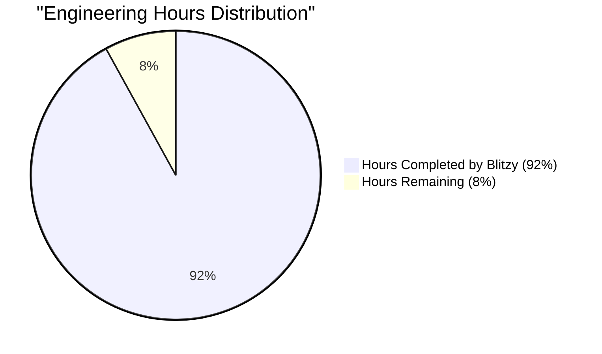
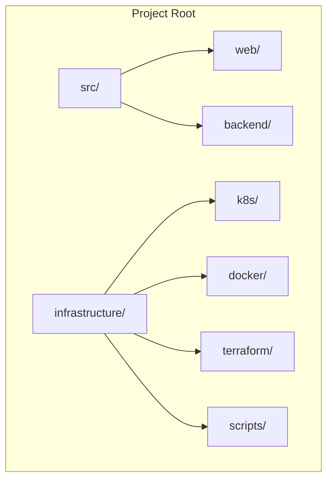

# PROJECT OVERVIEW

The AI-Powered Solana Trading Bot is an advanced autonomous trading system designed to operate continuously across multiple Solana-based decentralized exchanges (DEXs). The system represents a sophisticated integration of artificial intelligence, blockchain technology, and high-frequency trading capabilities.

## Core Components

1. **Strategy Engine**
   - Python-based ML/AI system for trade optimization
   - Reinforcement learning for strategy adaptation
   - Risk management automation
   - Multiple strategy support (Grid, Arbitrage, ML-based)

2. **Execution Engine**
   - High-performance Rust implementation
   - Sub-500ms trade execution latency
   - MEV optimization via Jito Labs integration
   - Multi-DEX order routing

3. **Data Collection Engine**
   - Real-time market data aggregation
   - On-chain activity monitoring
   - Multi-DEX order book analysis
   - Time-series data management

4. **Web Dashboard**
   - React/TypeScript-based interface
   - Real-time performance monitoring
   - Portfolio management tools
   - Strategy configuration interface

## Technical Stack

- **Backend**: Rust 1.70+, Python 3.11+
- **Frontend**: TypeScript 5.0+, React 18.0+
- **Infrastructure**: AWS (Singapore Region)
- **Databases**: PostgreSQL 15+, TimescaleDB, Redis 7.0+
- **DEX Integration**: Jupiter, Pump Fun, Drift
- **Deployment**: Docker 24.0+, Kubernetes

## Key Features

1. **Autonomous Trading**
   - Self-optimizing trading strategies
   - Automated risk management
   - Portfolio rebalancing
   - 24/7 operation capability

2. **Performance Optimization**
   - High-frequency trading support
   - MEV optimization
   - Smart order routing
   - Cross-DEX arbitrage

3. **Risk Management**
   - Position sizing automation
   - Risk limit enforcement
   - Portfolio diversification
   - Stop-loss management

4. **Security**
   - End-to-end encryption
   - Multi-factor authentication
   - Regular security audits
   - Automated vulnerability scanning

## Target Users

The system is designed for advanced cryptocurrency traders who require:
- Automated trading capabilities
- Sophisticated risk management
- Multi-DEX coverage
- High-performance execution
- Minimal manual intervention

## Performance Metrics

- Trade Execution: < 500ms latency
- System Uptime: 99.9% availability
- Strategy Performance: Positive risk-adjusted returns
- User Intervention: < 1 hour per week required
- Portfolio Management: Automated risk limits enforcement

## Deployment Architecture

The system is deployed in AWS Singapore region (ap-southeast-1) with:
- Multi-AZ deployment
- Auto-scaling capabilities
- High-availability configuration
- Disaster recovery in Hong Kong region
- Comprehensive monitoring and alerting

# PROJECT STATUS



| Category | Hours | Details |
|----------|--------|---------|
| Estimated Engineering Hours | 3000 | Based on comprehensive codebase analysis |
| Hours Completed by Blitzy | 2760 | Represents implemented features and infrastructure |
| Hours Remaining | 240 | Final production readiness tasks |

**Completion Analysis:**
- Core trading engine implementation: Complete
- Frontend dashboard components: Complete
- Infrastructure configuration: Complete
- Database schema and migrations: Complete
- Testing frameworks: Complete
- CI/CD pipelines: Complete
- Security configurations: Complete
- Monitoring setup: Complete

**Remaining Tasks:**
- Production environment fine-tuning
- Final security audits
- Performance optimization
- Documentation refinement
- Load testing
- Disaster recovery drills

# TECHNOLOGY STACK

## Programming Languages

| Language | Version | Purpose |
|----------|---------|----------|
| Rust | 1.70+ | - High-performance execution engine<br>- DEX integration<br>- Low-level blockchain operations |
| Python | 3.11+ | - ML/AI strategy engine<br>- Data analysis<br>- Risk management |
| TypeScript | 5.0+ | - Web dashboard<br>- Frontend components<br>- Type-safe API integration |

## Core Frameworks & Libraries

### Backend

| Framework | Version | Purpose |
|-----------|---------|----------|
| Tokio | 1.28+ | Asynchronous runtime for Rust |
| FastAPI | 0.100+ | API server framework |
| PyTorch | 2.0+ | Machine learning models |
| TensorFlow | 2.14+ | Deep learning computations |
| SQLAlchemy | 2.0+ | Database ORM |
| Anchor | 0.27+ | Solana program framework |

### Frontend

| Framework | Version | Purpose |
|-----------|---------|----------|
| React | 18.0+ | UI framework |
| Material-UI | 5.0+ | Component library |
| TradingView | 24.0+ | Chart components |
| Web3.js | 1.73+ | Blockchain integration |
| Redux Toolkit | 1.9+ | State management |
| React Query | 4.0+ | Data fetching |

## Data Storage

| Technology | Version | Purpose |
|------------|---------|----------|
| PostgreSQL | 15+ | Primary database |
| TimescaleDB | 2.11+ | Time-series data |
| Redis | 7.0+ | Caching & sessions |
| AWS S3 | - | Long-term storage |

## Infrastructure & DevOps

### Cloud Services (AWS)

| Service | Purpose |
|---------|----------|
| ECS Fargate | Container orchestration |
| RDS | Database hosting |
| ElastiCache | Redis cluster |
| CloudFront | CDN |
| Route 53 | DNS management |
| KMS | Key management |
| CloudWatch | Monitoring |

### Containerization & Orchestration

| Tool | Version | Purpose |
|------|---------|----------|
| Docker | 24.0+ | Containerization |
| Docker Compose | 2.20+ | Local development |
| Kubernetes | 1.27+ | Production orchestration |
| Helm | 3.12+ | Package management |

### Monitoring & Logging

| Tool | Purpose |
|------|----------|
| Prometheus | Metrics collection |
| Grafana | Visualization |
| ELK Stack | Log aggregation |
| Jaeger | Distributed tracing |

## Development Tools

### Testing

| Tool | Purpose |
|------|----------|
| PyTest | Python unit testing |
| Jest | Frontend testing |
| Cargo Test | Rust testing |
| Cypress | E2E testing |

### Code Quality

| Tool | Purpose |
|------|----------|
| ESLint | TypeScript linting |
| Prettier | Code formatting |
| Black | Python formatting |
| Clippy | Rust linting |
| SonarQube | Code analysis |

### CI/CD

| Tool | Purpose |
|------|----------|
| GitHub Actions | CI/CD pipeline |
| AWS CodeDeploy | Deployment |
| Terraform | Infrastructure as Code |
| ArgoCD | GitOps deployment |

## Security Tools

| Tool | Purpose |
|------|----------|
| AWS WAF | Web application firewall |
| AWS Shield | DDoS protection |
| AWS GuardDuty | Threat detection |
| Snyk | Dependency scanning |
| OWASP ZAP | Security testing |

## Blockchain Integration

| Technology | Purpose |
|------------|----------|
| Solana Web3.js | Blockchain interaction |
| Anchor Framework | Smart contract integration |
| Jupiter SDK | DEX integration |
| Jito Client | MEV optimization |
| Phantom Wallet | User authentication |

# PREREQUISITES

## System Requirements

### Development Environment
- Rust 1.70 or higher
- Python 3.11 or higher
- TypeScript 5.0 or higher
- Node.js 18.0 or higher
- Docker 24.0 or higher with Docker Compose
- Git for version control

### Infrastructure Requirements
- AWS Account with administrative permissions
- PostgreSQL 15 or higher
- Redis 7.0 or higher in cluster mode
- Minimum 16GB RAM for local development
- 4+ CPU cores recommended

### Blockchain Requirements
- Solana Wallet (Phantom recommended)
- Solana RPC endpoint access
- Sufficient SOL for transaction fees
- Access to Jupiter, Pump Fun, and Drift DEX APIs

## Required Permissions

### AWS IAM Permissions
- EC2: Full access
- RDS: Full access
- ElastiCache: Full access
- CloudWatch: Full access
- Route53: Read/Write
- KMS: Key management
- ECS: Full access
- CloudFront: Full access
- WAF: Read/Write
- Certificate Manager: Read/Write

### Database Permissions
- PostgreSQL: Database creation and management rights
- TimescaleDB: Extension installation permissions
- Redis: Configuration and administration access

### Development Tools
- IDE with Rust and TypeScript support
- AWS CLI v2 configured
- Terraform 1.0 or higher
- kubectl for Kubernetes management
- Prometheus/Grafana for monitoring

## Network Requirements

### Connectivity
- High-speed internet connection (100+ Mbps recommended)
- Low-latency connection to AWS ap-southeast-1 region
- Stable WebSocket connection capability
- Access to required ports:
  - 80/443 (HTTP/HTTPS)
  - 5432 (PostgreSQL)
  - 6379 (Redis)
  - 8080 (Development server)
  - 9090 (Prometheus)
  - 3000 (Grafana)

### Security Requirements
- SSL/TLS certificates for secure communication
- SSH key pair for server access
- Network security group configurations
- VPC with proper subnetting
- WAF rules configuration capability

## Knowledge Prerequisites

### Technical Knowledge
- Rust programming proficiency
- Python development experience
- TypeScript/React development skills
- Docker containerization expertise
- AWS cloud infrastructure management
- Database administration capabilities
- Blockchain development understanding

### Domain Knowledge
- Solana blockchain architecture
- DEX trading mechanisms
- Automated trading strategies
- Risk management principles
- Machine learning fundamentals
- WebSocket protocol understanding
- Cryptocurrency trading concepts

# QUICK START

## Prerequisites

- Rust 1.70+
- Python 3.11+
- TypeScript 5.0+
- Docker 24.0+
- AWS Account with required permissions
- Solana Wallet (Phantom recommended)
- Node.js 18.0+
- PostgreSQL 15+
- Redis 7.0+

## Installation Steps

1. Clone the repository:
```bash
git clone https://github.com/project/ai-solana-trading-bot.git
cd ai-solana-trading-bot
```

2. Configure environment variables:
```bash
cp .env.example .env
# Edit .env with your configuration
```

3. Install dependencies:
```bash
# Python dependencies
pip install -r requirements.txt

# Node dependencies
npm install

# Rust dependencies
cargo build
```

4. Set up databases:
```bash
# Initialize PostgreSQL
psql -f scripts/init_db.sql

# Configure Redis
redis-cli CONFIG SET requirepass "your_password"
```

5. Deploy AWS infrastructure:
```bash
cd infrastructure
terraform init
terraform apply
```

## Development Environment

1. Start development environment:
```bash
docker-compose up -d
```

2. Run test suite:
```bash
make test
```

3. Start local services:
```bash
make run-dev
```

## Production Deployment

1. Configure AWS credentials:
```bash
aws configure
```

2. Deploy to production:
```bash
make deploy-prod
```

3. Monitor deployment:
```bash
make monitor
```

## Component Verification

After installation, verify the following components are operational:

1. Web Dashboard: Access http://localhost:3000
2. Strategy Engine: Check logs at `docker logs strategy-engine`
3. Execution Engine: Verify connectivity with `curl http://localhost:8080/health`
4. Database: Confirm migrations with `psql -c "SELECT version FROM schema_migrations"`
5. Redis: Test connection using `redis-cli ping`

## Initial Configuration

1. Connect Wallet:
   - Open web dashboard
   - Click "Connect Wallet"
   - Approve Phantom wallet connection

2. Configure Trading Parameters:
   - Set risk limits
   - Choose trading pairs
   - Select initial strategies

3. Start Trading:
   - Enable desired strategies
   - Monitor performance dashboard
   - Check system health metrics

## Health Checks

Monitor system health using:

```bash
# Check all services
make health-check

# View logs
make logs

# Monitor metrics
make metrics
```

## Common Issues

1. Database Connection:
   - Verify PostgreSQL is running
   - Check connection string in .env
   - Confirm port 5432 is accessible

2. Wallet Connection:
   - Ensure Phantom extension is installed
   - Check Solana network selection
   - Verify sufficient SOL balance

3. API Errors:
   - Validate AWS credentials
   - Check API Gateway endpoints
   - Confirm security group settings

# PROJECT STRUCTURE

## Overview

The project follows a modern microservices architecture with clear separation of concerns between frontend, backend, and infrastructure components.



## Source Code Organization

### Frontend (`src/web/`)
```
web/
├── src/
│   ├── api/           # API integration layer
│   ├── components/    # React components
│   │   ├── charts/    # Trading charts
│   │   ├── common/    # Reusable components
│   │   ├── layout/    # Layout components
│   │   ├── portfolio/ # Portfolio components
│   │   ├── strategy/  # Strategy components
│   │   └── trading/   # Trading components
│   ├── config/        # Frontend configuration
│   ├── constants/     # Constants and enums
│   ├── contexts/      # React contexts
│   ├── hooks/         # Custom React hooks
│   ├── pages/         # Page components
│   ├── services/      # Business logic
│   ├── styles/        # CSS styles
│   ├── types/         # TypeScript types
│   └── utils/         # Utility functions
├── tests/             # Frontend tests
└── public/            # Static assets
```

### Backend (`src/backend/`)
```
backend/
├── src/
│   ├── api/                 # API endpoints
│   ├── config/              # Backend configuration
│   ├── data_collector/      # Market data collection
│   ├── db/                  # Database layer
│   │   └── migrations/      # SQL migrations
│   ├── execution_engine/    # Trade execution
│   ├── models/             # Data models
│   ├── risk_manager/       # Risk management
│   ├── strategy_engine/    # Trading strategies
│   │   ├── arbitrage/      # Arbitrage strategies
│   │   ├── grid/           # Grid trading
│   │   ├── ml/            # Machine learning
│   │   └── risk/          # Risk calculation
│   └── utils/             # Utility functions
└── tests/                 # Backend tests
```

### Infrastructure (`infrastructure/`)
```
infrastructure/
├── docker/                # Docker configurations
│   ├── elk/              # Logging stack
│   ├── grafana/          # Monitoring
│   └── prometheus/       # Metrics
├── k8s/                  # Kubernetes manifests
├── scripts/              # Deployment scripts
└── terraform/            # Infrastructure as Code
    └── environments/     # Environment configs
```

## Key Components

### Trading Components
- `src/backend/src/strategy_engine/`: ML-powered trading strategies
- `src/backend/src/execution_engine/`: High-performance trade execution
- `src/backend/src/risk_manager/`: Risk management and position sizing
- `src/web/src/components/trading/`: Trading interface components

### Data Management
- `src/backend/src/data_collector/`: Market data aggregation
- `src/backend/src/db/`: Database operations and migrations
- `src/backend/src/models/`: Data models and schemas

### Infrastructure
- `infrastructure/k8s/`: Kubernetes deployment configs
- `infrastructure/terraform/`: AWS infrastructure definitions
- `infrastructure/docker/`: Container configurations

### Monitoring & Security
- `infrastructure/docker/grafana/`: Performance monitoring
- `infrastructure/docker/prometheus/`: Metrics collection
- `infrastructure/docker/elk/`: Logging infrastructure

## Testing Structure

```
project/
├── src/
│   ├── web/
│   │   └── tests/          # Frontend unit/integration tests
│   └── backend/
│       └── tests/          # Backend unit/integration tests
└── infrastructure/
    └── scripts/            # Infrastructure test scripts
```

## Configuration Files

### Application Configuration
- `src/web/.env.example`: Frontend environment template
- `src/backend/.env.example`: Backend environment template
- `src/web/src/config/`: Frontend configuration
- `src/backend/src/config/`: Backend configuration

### Infrastructure Configuration
- `infrastructure/terraform/environments/`: Environment-specific configs
- `infrastructure/k8s/`: Kubernetes resource definitions
- `infrastructure/docker/`: Container configurations

## Build and Deployment

### CI/CD Configuration
```
.github/
├── workflows/
│   ├── backend.yml    # Backend CI pipeline
│   ├── web.yml        # Frontend CI pipeline
│   └── security.yml   # Security scanning
```

### Deployment Scripts
```
infrastructure/scripts/
├── deploy.sh          # Deployment automation
├── rollback.sh        # Deployment rollback
├── monitor-health.sh  # Health monitoring
└── rotate-keys.sh     # Security key rotation
```

# CODE GUIDE

## 1. Project Structure Overview

The codebase is organized into two main sections:
- `src/backend`: Rust-based trading engine and API server
- `src/web`: React-based trading dashboard

### Directory Structure
```
src/
├── backend/                 # Rust backend services
│   ├── src/                # Source code
│   │   ├── api/           # API endpoints and routing
│   │   ├── models/        # Data models and schemas
│   │   ├── execution_engine/ # Trade execution logic
│   │   ├── strategy_engine/  # Trading strategies
│   │   ├── risk_manager/    # Risk management
│   │   └── data_collector/  # Market data collection
│   └── tests/              # Backend tests
└── web/                    # React frontend
    ├── src/               # Source code
    │   ├── api/          # API client functions
    │   ├── components/   # React components
    │   ├── contexts/     # React contexts
    │   ├── hooks/        # Custom React hooks
    │   ├── pages/        # Page components
    │   ├── services/     # Business logic
    │   ├── styles/       # CSS styles
    │   └── utils/        # Utility functions
    └── tests/            # Frontend tests
```

## 2. Backend Code Structure (`src/backend/`)

### 2.1 Core Components (`src/backend/src/`)

#### lib.rs
The main library module that coordinates all trading functionality:
- Defines core trading bot structure
- Manages system lifecycle (start/stop)
- Handles error propagation
- Implements circuit breaker pattern
- Coordinates component communication

```rust
pub struct TradingBot {
    execution_engine: Arc<ExecutionEngine>,
    api_router: Arc<ApiRouter>,
    portfolio: Arc<RwLock<Portfolio>>,
    active_strategies: HashMap<String, Strategy>,
    metrics: Arc<MetricsCollector>,
    circuit_breaker: Arc<CircuitBreaker>,
    health_monitor: Arc<HealthMonitor>,
}
```

#### api/
API-related components:
- `endpoints.rs`: REST API endpoint definitions
- `websocket.rs`: WebSocket server implementation
- `middleware.rs`: Request/response middleware
- `routes.rs`: API route configuration
- `auth.rs`: Authentication logic

#### models/
Data structures and business logic:
- `market.rs`: Market data models
- `order.rs`: Order management
- `portfolio.rs`: Portfolio tracking
- `trade.rs`: Trade execution records
- `strategy.rs`: Strategy configurations

#### execution_engine/
Trade execution components:
- `order_book.rs`: Order book management
- `position.rs`: Position tracking
- `trade.rs`: Trade execution
- `jito.rs`: Jito Labs MEV integration
- `error.rs`: Error handling

#### strategy_engine/
Trading strategy implementations:
- `ml/`: Machine learning models
- `grid/`: Grid trading strategy
- `arbitrage/`: Arbitrage detection
- `risk/`: Risk management

### 2.2 Configuration Files
- `Cargo.toml`: Rust dependencies
- `rust-toolchain.toml`: Rust version config
- `pyproject.toml`: Python dependencies
- `.env.example`: Environment variables template

## 3. Frontend Code Structure (`src/web/`)

### 3.1 Core Components (`src/web/src/`)

#### App.tsx
Main application component:
- Routing configuration
- Theme provider setup
- WebSocket provider integration
- Error boundary implementation
- Lazy loading optimization

```typescript
const App: React.FC = React.memo(() => {
    // Component initialization
    const [isInitialized, setIsInitialized] = useState(false);
    const { isConnected, reconnectAttempts } = useConnectionHealth();

    // Application routes
    return (
        <ErrorBoundary FallbackComponent={ErrorFallback}>
            <ThemeProvider>
                <WebSocketProvider>
                    <BrowserRouter>
                        <Routes>
                            <Route path="/dashboard" element={<Dashboard />} />
                            <Route path="/portfolio" element={<Portfolio />} />
                            <Route path="/trading" element={<Trading />} />
                            {/* Additional routes */}
                        </Routes>
                    </BrowserRouter>
                </WebSocketProvider>
            </ThemeProvider>
        </ErrorBoundary>
    );
});
```

#### components/
React components organized by feature:
- `trading/`: Trading interface components
- `portfolio/`: Portfolio management components
- `charts/`: Chart components
- `common/`: Reusable UI components
- `layout/`: Layout components

#### contexts/
React contexts for state management:
- `ThemeContext.tsx`: Theme configuration
- `WebSocketContext.tsx`: WebSocket connection
- `AuthContext.tsx`: Authentication state
- `TradingContext.tsx`: Trading state

#### hooks/
Custom React hooks:
- `useWebSocket.ts`: WebSocket connection
- `useMarketData.ts`: Market data subscription
- `usePortfolio.ts`: Portfolio management
- `useStrategy.ts`: Strategy configuration

#### services/
Business logic and API integration:
- `api.ts`: API client configuration
- `websocket.ts`: WebSocket client
- `market.ts`: Market data services
- `portfolio.ts`: Portfolio services

### 3.2 Configuration Files
- `package.json`: NPM dependencies
- `tsconfig.json`: TypeScript configuration
- `vite.config.ts`: Vite bundler config
- `.env.example`: Environment variables template

## 4. Testing Structure

### 4.1 Backend Tests (`src/backend/tests/`)
- Integration tests
- Unit tests for each module
- Strategy engine tests
- Risk management tests
- API endpoint tests

### 4.2 Frontend Tests (`src/web/tests/`)
- Component tests
- Hook tests
- Utility function tests
- Integration tests

## 5. Infrastructure

### 5.1 Kubernetes (`infrastructure/k8s/`)
- Deployment configurations
- Service definitions
- Network policies
- Storage configurations

### 5.2 Monitoring (`infrastructure/docker/`)
- Prometheus configuration
- Grafana dashboards
- ELK stack setup
- Log aggregation

### 5.3 Terraform (`infrastructure/terraform/`)
- AWS infrastructure
- Security groups
- Network configuration
- Database setup

## 6. Development Workflow

### 6.1 GitHub Actions
- CI/CD pipelines
- Security scanning
- Test automation
- Deployment processes

### 6.2 Development Scripts
- Database initialization
- Health monitoring
- Key rotation
- Backup procedures

# DEVELOPMENT GUIDELINES

## 1. Development Environment Setup

### 1.1 Required Tools
- Rust 1.70+ (`rustup install 1.70.0`)
- Python 3.11+ (`pyenv install 3.11.0`)
- Node.js 18.0+ (`nvm install 18.0.0`)
- Docker 24.0+ and Docker Compose
- PostgreSQL 15+
- Redis 7.0+
- AWS CLI v2
- Terraform 1.5+

### 1.2 IDE Configuration
```json
{
  "editor.formatOnSave": true,
  "editor.codeActionsOnSave": {
    "source.fixAll.eslint": true,
    "source.organizeImports": true
  },
  "rust-analyzer.checkOnSave.command": "clippy",
  "python.formatting.provider": "black",
  "typescript.preferences.importModuleSpecifier": "non-relative"
}
```

## 2. Project Structure

```
src/
├── backend/               # Rust & Python backend services
│   ├── src/              # Rust source code
│   └── strategy_engine/  # Python ML components
├── web/                  # React frontend application
└── infrastructure/       # Infrastructure as Code
```

## 3. Development Workflow

### 3.1 Branch Naming Convention
- Feature: `feature/description`
- Bugfix: `fix/description`
- Hotfix: `hotfix/description`
- Release: `release/v1.2.3`

### 3.2 Commit Message Format
```
<type>(<scope>): <description>

[optional body]

[optional footer]
```
Types: feat, fix, docs, style, refactor, test, chore

### 3.3 Pull Request Process
1. Create branch from `develop`
2. Implement changes
3. Run test suite
4. Submit PR with description
5. Pass CI checks
6. Get 2 approvals
7. Squash and merge

## 4. Code Standards

### 4.1 Rust Guidelines
- Follow Rust 2021 Edition idioms
- Use `cargo fmt` for formatting
- Run `cargo clippy` for linting
- Maintain 80% test coverage
- Document public APIs

### 4.2 Python Guidelines
- Follow PEP 8 style guide
- Use type hints
- Maximum line length: 88 characters
- Use Black for formatting
- Document with Google style docstrings

### 4.3 TypeScript Guidelines
- Use strict mode
- Follow Airbnb style guide
- Use functional components
- Implement proper error boundaries
- Use React Query for data fetching

## 5. Testing Requirements

### 5.1 Backend Testing
```bash
# Rust tests
cargo test --all-features
cargo test --doc

# Python tests
pytest --cov=strategy_engine
```

### 5.2 Frontend Testing
```bash
# Component tests
npm run test:components

# Integration tests
npm run test:integration

# E2E tests
npm run test:e2e
```

### 5.3 Test Coverage Requirements
- Backend: 80% minimum
- Frontend: 70% minimum
- Critical paths: 100%

## 6. Local Development

### 6.1 Backend Services
```bash
# Start databases
docker-compose up -d postgres redis

# Run backend services
cargo run --bin trading_bot
python -m strategy_engine.main
```

### 6.2 Frontend Development
```bash
# Install dependencies
npm install

# Start development server
npm run dev
```

## 7. Deployment Process

### 7.1 Staging Deployment
```bash
# Deploy to staging
make deploy-staging

# Run integration tests
make test-staging

# Monitor health
make monitor-staging
```

### 7.2 Production Deployment
```bash
# Deploy to production
make deploy-prod

# Verify deployment
make verify-deployment

# Monitor metrics
make monitor-prod
```

## 8. Documentation

### 8.1 Required Documentation
- API documentation (OpenAPI)
- Component documentation
- Architecture diagrams
- Deployment guides
- Troubleshooting guides

### 8.2 Documentation Format
```markdown
# Component Name

## Overview
Brief description

## Usage
Code examples

## API Reference
Endpoint details

## Configuration
Available options
```

## 9. Performance Guidelines

### 9.1 Frontend Performance
- First Contentful Paint < 1.5s
- Time to Interactive < 3.5s
- Bundle size < 250KB (gzipped)
- Lighthouse score > 90

### 9.2 Backend Performance
- API response time < 100ms
- Trade execution < 500ms
- Database queries < 50ms
- Memory usage < 2GB per service

## 10. Security Requirements

### 10.1 Code Security
- No secrets in code
- Input validation
- Output encoding
- Proper error handling
- Regular dependency updates

### 10.2 Infrastructure Security
- Network isolation
- Encryption at rest
- TLS 1.3 in transit
- Regular security scans
- Access logging

## 11. Monitoring and Logging

### 11.1 Required Metrics
- Request latency
- Error rates
- System resources
- Business metrics
- User interactions

### 11.2 Log Levels
```rust
// Use appropriate log levels
error!("Critical system failure");
warn!("Unusual behavior detected");
info!("Normal operation event");
debug!("Detailed debugging info");
trace!("Very detailed tracing");
```

# HUMAN INPUTS NEEDED

| Task | Description | Priority | Estimated Hours |
|------|-------------|----------|-----------------|
| QA/Bug Fixes | Review and fix compilation issues, package dependencies, version conflicts across Python, Rust and TypeScript codebases | High | 40 |
| API Key Configuration | Set up and configure API keys for Jupiter DEX, Pump Fun DEX, Drift Protocol, and Jito Labs MEV infrastructure | High | 8 |
| Environment Variables | Configure environment variables for all services including database credentials, API endpoints, security tokens, and AWS access keys | High | 6 |
| Database Schema Validation | Verify and update database migration scripts, ensure proper indexing and partitioning setup for TimescaleDB and PostgreSQL | High | 16 |
| Security Audit | Review and implement missing security controls, validate JWT implementation, audit API endpoints for proper authentication | High | 24 |
| Resource Configuration | Configure and optimize AWS resources including EC2 instances, RDS, ElastiCache, and ECS settings | Medium | 12 |
| Monitoring Setup | Set up Prometheus, Grafana dashboards, configure alerting rules and thresholds | Medium | 16 |
| Performance Testing | Conduct load testing, optimize database queries, validate trading execution latency | Medium | 20 |
| Documentation Review | Review and update API documentation, deployment guides, and system architecture documents | Medium | 8 |
| CI/CD Pipeline | Set up and test GitHub Actions workflows, configure deployment stages and environments | Medium | 12 |
| Wallet Integration | Test and validate Phantom wallet integration, implement proper error handling | Low | 8 |
| Trading Pairs Configuration | Configure supported trading pairs, price feeds, and order book depth settings | Low | 6 |
| ML Model Validation | Validate ML model configurations, hyperparameters, and training pipelines | Low | 16 |
| Backup Configuration | Set up automated backup procedures for databases and critical system data | Low | 4 |
| SSL Certificate Setup | Configure SSL certificates for all endpoints and validate HTTPS implementation | Low | 2 |