# Technical Specifications

# 1. INTRODUCTION

## 1.1 EXECUTIVE SUMMARY

The AI-Powered Solana Trading Bot represents a cutting-edge autonomous trading system designed to operate continuously across multiple Solana-based decentralized exchanges (DEXs). The system addresses the critical challenge faced by advanced cryptocurrency traders who require a hands-off solution for managing complex trading strategies while optimizing returns and minimizing risks. By leveraging artificial intelligence and machine learning, the bot autonomously executes trades, manages risk, and adapts to changing market conditions without requiring constant user intervention.

The system's value proposition centers on its ability to outperform traditional trading bots through self-optimizing strategies, multi-DEX coverage, and high-speed execution on Solana's infrastructure, offering advanced traders a sophisticated "set-it-and-forget-it" solution for cryptocurrency trading.

## 1.2 SYSTEM OVERVIEW

### Project Context

| Aspect | Description |
|--------|-------------|
| Market Position | Premium autonomous trading solution for Solana DEX ecosystem |
| Target Market | Advanced cryptocurrency traders seeking automated solutions |
| Competitive Edge | AI/ML-driven strategy optimization, multi-DEX coverage, full automation |
| Integration Landscape | Solana blockchain, Multiple DEXs (Jupiter, Pump Fun, Drift), Jito Labs MEV infrastructure |

### High-Level Description

The system comprises four primary components:

1. Data Collection Engine
- Real-time market data aggregation
- On-chain activity monitoring
- Multi-DEX order book analysis

2. AI/ML Strategy Core
- Dynamic strategy selection
- Reinforcement learning optimization
- Risk management automation

3. Execution Engine
- High-speed trade execution
- MEV optimization
- Multi-DEX routing

4. Monitoring Interface
- Web-based dashboard
- Performance analytics
- Portfolio management

### Success Criteria

| Metric | Target |
|--------|---------|
| Trade Execution Speed | < 500ms latency |
| System Uptime | 99.9% availability |
| Strategy Performance | Positive risk-adjusted returns |
| Portfolio Management | Automated risk limits enforcement |
| User Intervention | < 1 hour per week required |

## 1.3 SCOPE

### In-Scope Elements

| Category | Components |
|----------|------------|
| Core Trading Functions | - Automated strategy selection and execution<br>- Real-time market data analysis<br>- Risk management and position sizing<br>- Portfolio rebalancing |
| Exchange Integration | - Jupiter DEX<br>- Pump Fun DEX<br>- Drift Protocol |
| Technical Infrastructure | - AWS Singapore deployment<br>- High-frequency trading capabilities<br>- Automated failover systems |
| User Interface | - Web-based dashboard<br>- Performance monitoring<br>- Wallet integration |
| Security Features | - Encryption of sensitive data<br>- Secure API management<br>- Transaction signing |

### Out-of-Scope Elements

- Manual trading capabilities
- Mobile applications
- Support for non-Solana blockchains
- Social trading features
- Customer support system
- Trading signals distribution
- Third-party strategy marketplace
- Fiat currency integration
- Tax reporting tools
- Multi-user account management

# 2. SYSTEM ARCHITECTURE

## 2.1 High-Level Architecture

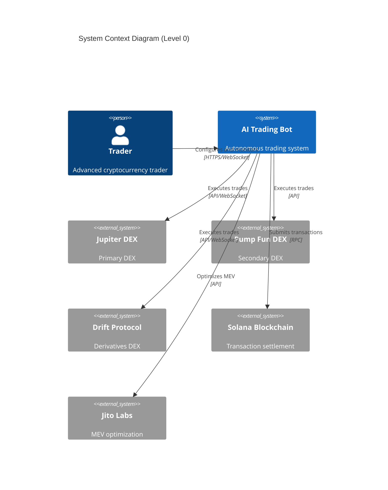

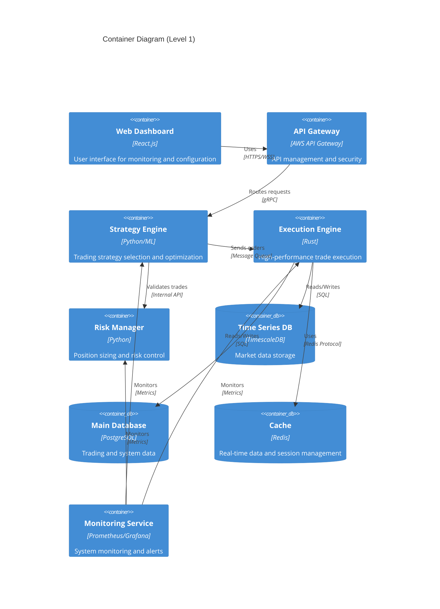

## 2.2 Component Details

### 2.2.1 Core Components

| Component | Purpose | Technology Stack | Key Interfaces | Data Storage | Scaling Strategy |
|-----------|---------|-----------------|----------------|--------------|------------------|
| Strategy Engine | Trading strategy selection and optimization | Python, TensorFlow, PyTorch | gRPC, REST | TimescaleDB | Horizontal scaling with model parallelization |
| Execution Engine | High-speed trade execution | Rust, Tokio | WebSocket, RPC | PostgreSQL | Vertical scaling with concurrent processing |
| Risk Manager | Position sizing and risk control | Python | Internal API | PostgreSQL | Horizontal scaling with sharding |
| Data Collector | Market data aggregation | Python, Rust | WebSocket, REST | TimescaleDB | Horizontal scaling per data source |
| Web Dashboard | User interface | React.js, TypeScript | REST, WebSocket | Redis (session) | Static content distribution |

### 2.2.2 Supporting Services

| Service | Purpose | Technology Stack | Scaling Approach |
|---------|---------|-----------------|------------------|
| API Gateway | Request routing and security | AWS API Gateway | Auto-scaling |
| Cache Layer | Performance optimization | Redis Cluster | Memory-based scaling |
| Message Queue | Async communication | RabbitMQ | Cluster with mirroring |
| Monitoring | System observability | Prometheus, Grafana | Federated monitoring |
| Load Balancer | Traffic distribution | AWS ALB | Auto-scaling |

## 2.3 Technical Decisions

### 2.3.1 Architecture Patterns

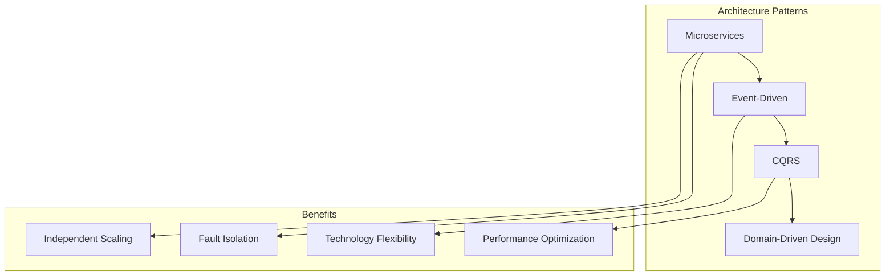

### 2.3.2 Data Storage Solutions

| Data Type | Storage Solution | Justification |
|-----------|-----------------|----------------|
| Market Data | TimescaleDB | Optimized for time-series data with high ingestion rates |
| Trade History | PostgreSQL | ACID compliance for critical transaction data |
| Real-time Data | Redis | In-memory performance for live trading data |
| System Metrics | Prometheus | Purpose-built for metrics with efficient storage |
| User Sessions | Redis | Fast access and automatic expiration |

## 2.4 Cross-Cutting Concerns

### 2.4.1 System Monitoring

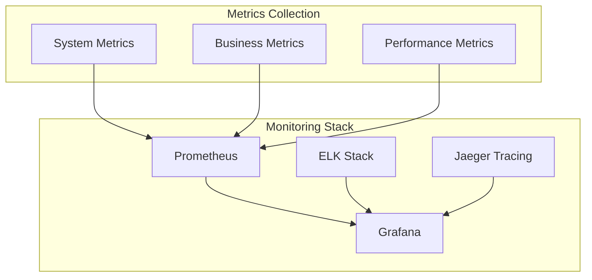

### 2.4.2 Security Architecture

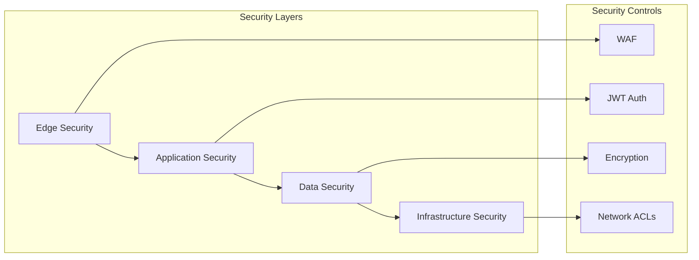

## 2.5 Deployment Architecture

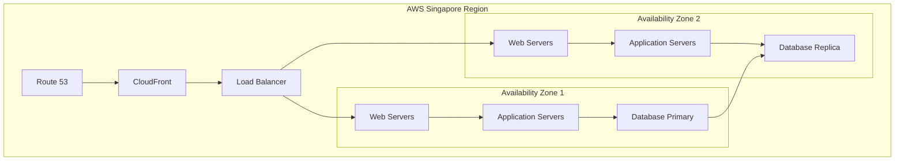

# 3. SYSTEM COMPONENTS ARCHITECTURE

## 3.1 USER INTERFACE DESIGN

### 3.1.1 Design Specifications

| Category | Requirements |
|----------|--------------|
| Visual Hierarchy | - Dark theme optimized for trading<br>- High contrast for data visualization<br>- Consistent typography scale<br>- Grid-based layout system |
| Component Library | - Custom React components for trading widgets<br>- Material-UI foundation<br>- TradingView chart integration<br>- Real-time data components |
| Responsive Design | - Minimum viewport: 1920x1080<br>- Support for ultra-wide monitors<br>- Dynamic grid layouts<br>- Flexible chart scaling |
| Accessibility | - WCAG 2.1 Level AA compliance<br>- Screen reader compatibility<br>- Keyboard navigation support<br>- High contrast mode |
| Browser Support | - Chrome 90+<br>- Firefox 88+<br>- Safari 14+<br>- Edge 90+ |

### 3.1.2 Interface Layout

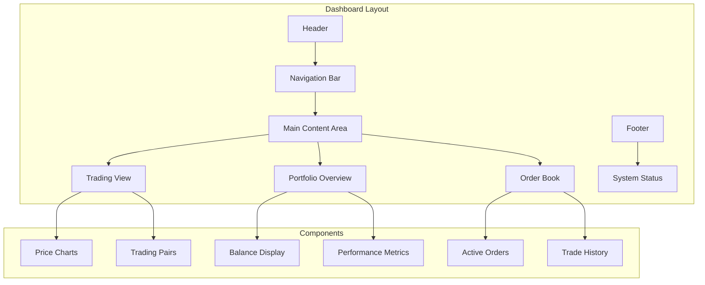

### 3.1.3 Critical User Flows

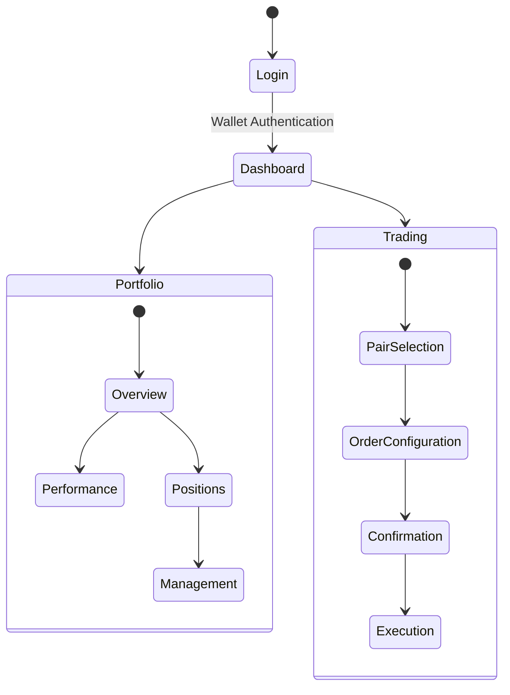

## 3.2 DATABASE DESIGN

### 3.2.1 Schema Design

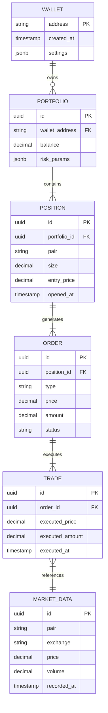

### 3.2.2 Data Management Strategy

| Aspect | Implementation |
|--------|---------------|
| Partitioning | - Time-based partitioning for market data<br>- Hash partitioning for user data<br>- Range partitioning for trade history |
| Indexing | - B-tree indexes for primary keys<br>- Hash indexes for wallet addresses<br>- GiST indexes for time-series data |
| Archival | - 90-day retention for raw market data<br>- 7-year retention for trade history<br>- Compressed cold storage for archived data |
| Backup | - Continuous WAL archiving<br>- Daily full backups<br>- Cross-region replication |

## 3.3 API DESIGN

### 3.3.1 API Architecture

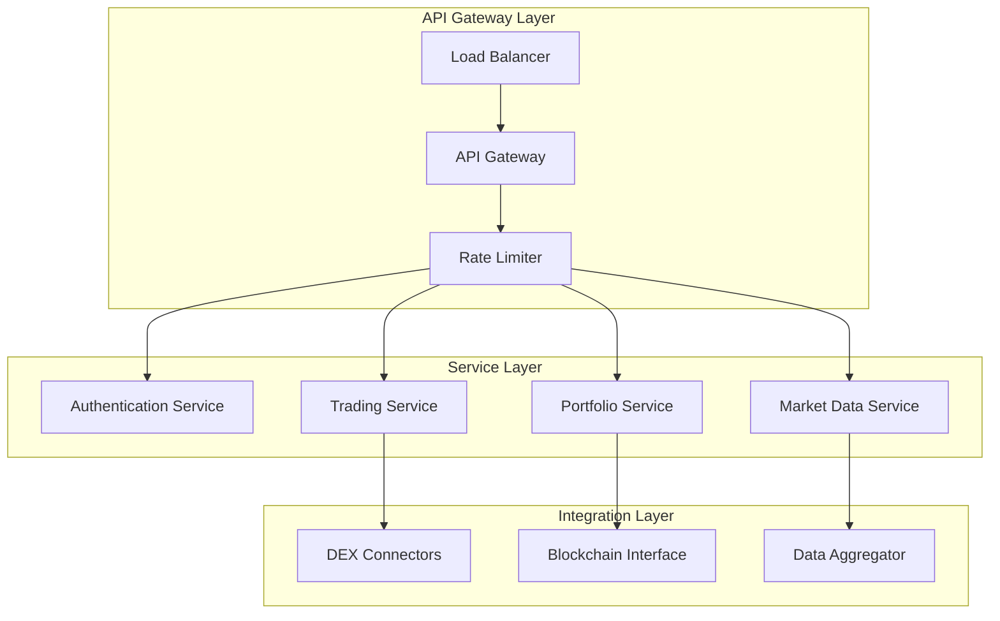

### 3.3.2 API Specifications

| Endpoint Category | Authentication | Rate Limit | Caching |
|------------------|----------------|------------|----------|
| Market Data | JWT | 1000/min | 5s TTL |
| Trading | JWT + Signature | 100/min | No Cache |
| Portfolio | JWT | 300/min | 30s TTL |
| System Status | JWT | 60/min | 60s TTL |

### 3.3.3 Integration Patterns

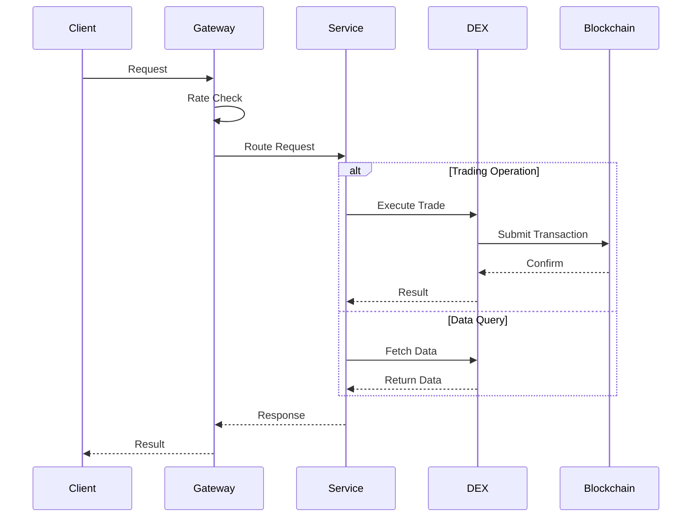

# 4. TECHNOLOGY STACK

## 4.1 PROGRAMMING LANGUAGES

| Component | Language | Version | Justification |
|-----------|----------|---------|---------------|
| Strategy Engine | Python | 3.11+ | - Extensive ML/AI libraries<br>- Rich ecosystem for data analysis<br>- Rapid prototyping capabilities |
| Execution Engine | Rust | 1.70+ | - Near-native performance<br>- Memory safety guarantees<br>- Excellent Solana integration |
| Web Dashboard | TypeScript | 5.0+ | - Type safety for complex trading interfaces<br>- Enhanced developer productivity<br>- Better maintainability |
| Data Collectors | Rust/Python | - | - Rust for high-performance collectors<br>- Python for complex data processing |

## 4.2 FRAMEWORKS & LIBRARIES

### 4.2.1 Core Frameworks

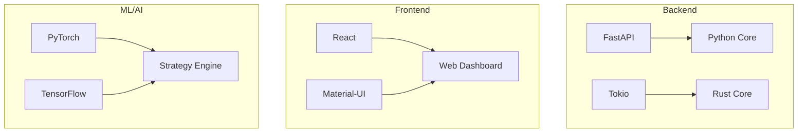

| Component | Framework | Version | Purpose |
|-----------|-----------|---------|----------|
| API Server | FastAPI | 0.100+ | High-performance async API endpoints |
| Web Frontend | React | 18.0+ | Interactive trading dashboard |
| UI Components | Material-UI | 5.0+ | Professional trading interface components |
| ML Framework | PyTorch | 2.0+ | Deep learning and strategy optimization |
| Async Runtime | Tokio | 1.28+ | Asynchronous Rust runtime for execution engine |

### 4.2.2 Supporting Libraries

| Category | Libraries | Purpose |
|----------|-----------|----------|
| Data Processing | - Pandas 2.0+<br>- NumPy 1.24+<br>- SciPy 1.10+ | Market data analysis and processing |
| Blockchain | - Anchor 0.27+<br>- Solana Web3.js 1.73+ | Solana blockchain interaction |
| Monitoring | - Prometheus Client 0.17+<br>- OpenTelemetry 1.18+ | System metrics and tracing |
| Testing | - PyTest 7.3+<br>- Jest 29.0+<br>- Cargo Test | Comprehensive testing suite |

## 4.3 DATABASES & STORAGE

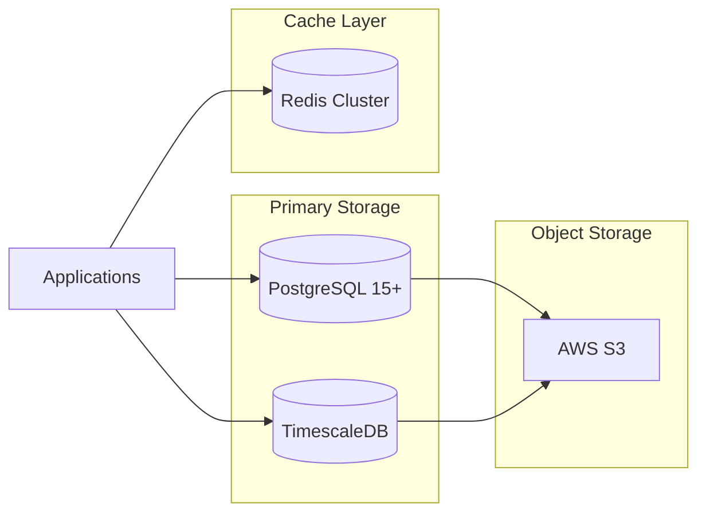

### 4.3.1 Database Solutions

| Database | Purpose | Configuration |
|----------|----------|---------------|
| PostgreSQL 15+ | - Core transaction data<br>- User portfolios<br>- Trade history | - Multi-AZ deployment<br>- Read replicas<br>- Point-in-time recovery |
| TimescaleDB | - Market data time series<br>- Performance metrics<br>- System telemetry | - Automated partitioning<br>- Continuous aggregates<br>- Data retention policies |
| Redis Cluster | - Real-time market data<br>- Session management<br>- Rate limiting | - Multi-node cluster<br>- AOF persistence<br>- Automatic failover |

## 4.4 THIRD-PARTY SERVICES

### 4.4.1 External Integrations

| Service | Purpose | Integration Method |
|---------|----------|-------------------|
| Jupiter DEX | Primary trading venue | REST API & WebSocket |
| Pump Fun DEX | Secondary trading venue | REST API |
| Drift Protocol | Derivatives trading | WebSocket & gRPC |
| Jito Labs | MEV optimization | REST API |
| Phantom Wallet | User authentication | Web3 API |

### 4.4.2 Cloud Services

| Service | Purpose | Configuration |
|---------|----------|---------------|
| AWS EC2 | Compute instances | t3.xlarge, auto-scaling |
| AWS RDS | Database hosting | Multi-AZ, Performance Insights |
| AWS ElastiCache | Redis cluster | r6g.large, Multi-AZ |
| AWS CloudWatch | Monitoring and logging | Custom metrics, Log insights |
| AWS KMS | Key management | Automatic rotation |

## 4.5 DEVELOPMENT & DEPLOYMENT

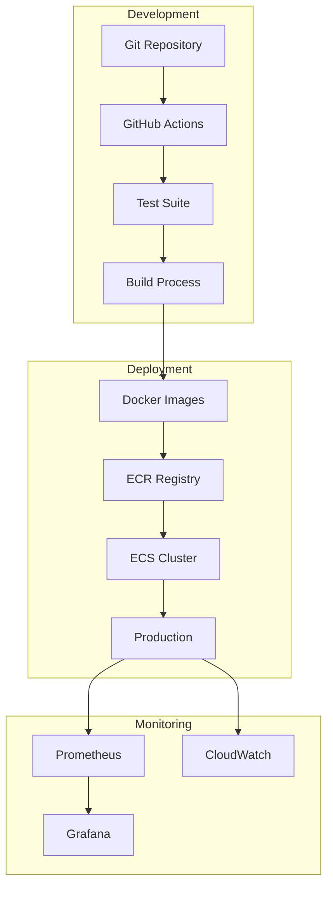

### 4.5.1 Development Tools

| Category | Tools | Purpose |
|----------|-------|----------|
| IDE | - VSCode<br>- PyCharm Professional | Development environment |
| Version Control | - Git<br>- GitHub | Code management |
| Documentation | - Sphinx<br>- TypeDoc | API and code documentation |
| Code Quality | - Black<br>- ESLint<br>- Clippy | Code formatting and linting |

### 4.5.2 Deployment Pipeline

| Stage | Tools | Configuration |
|-------|-------|---------------|
| Build | - Docker 24.0+<br>- BuildKit | Multi-stage builds |
| CI/CD | - GitHub Actions<br>- AWS CodeDeploy | Automated pipeline |
| Orchestration | - AWS ECS<br>- AWS Fargate | Container management |
| Monitoring | - Prometheus<br>- Grafana<br>- CloudWatch | System observability |

# 5. SYSTEM DESIGN

## 5.1 USER INTERFACE DESIGN

### 5.1.1 Dashboard Layout

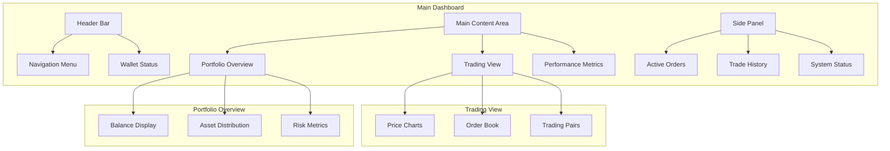

### 5.1.2 Component Specifications

| Component | Features | Data Updates | Interactions |
|-----------|----------|--------------|--------------|
| Price Charts | - TradingView integration<br>- Multiple timeframes<br>- Technical indicators | Real-time | Zoom, Pan, Indicator Config |
| Order Book | - Bid/Ask visualization<br>- Depth chart<br>- Volume heatmap | 100ms refresh | Click to view details |
| Portfolio View | - Asset allocation<br>- Performance graphs<br>- Risk indicators | 1s refresh | Filter, Sort, Export |
| System Status | - Component health<br>- Performance metrics<br>- Alert notifications | 5s refresh | Acknowledge alerts |

## 5.2 DATABASE DESIGN

### 5.2.1 Schema Design

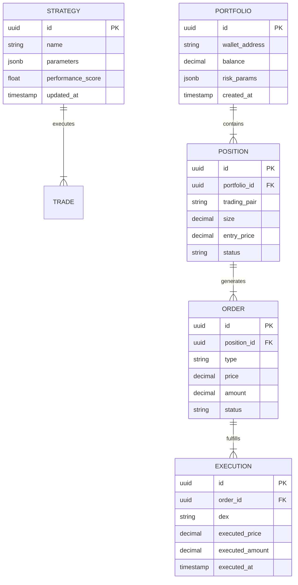

### 5.2.2 Data Storage Strategy

| Data Type | Storage Solution | Retention Policy | Backup Strategy |
|-----------|-----------------|------------------|-----------------|
| Market Data | TimescaleDB | 90 days | Continuous archival |
| Trade History | PostgreSQL | 7 years | Daily snapshots |
| User Data | PostgreSQL | Account lifetime | Real-time replication |
| Performance Metrics | TimescaleDB | 1 year | Weekly backups |
| System Logs | CloudWatch | 30 days | S3 archival |

## 5.3 API DESIGN

### 5.3.1 API Architecture

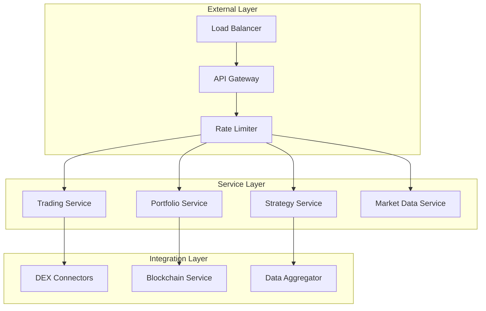

### 5.3.2 API Endpoints

| Endpoint | Method | Purpose | Rate Limit | Authentication |
|----------|--------|---------|------------|----------------|
| /api/v1/portfolio | GET | Portfolio status | 100/min | JWT |
| /api/v1/trades | GET | Trade history | 300/min | JWT |
| /api/v1/market-data | GET | Real-time prices | 1000/min | JWT |
| /api/v1/orders | POST | Create order | 60/min | JWT + Signature |
| /api/v1/strategy | GET | Strategy status | 100/min | JWT |

### 5.3.3 Integration Patterns

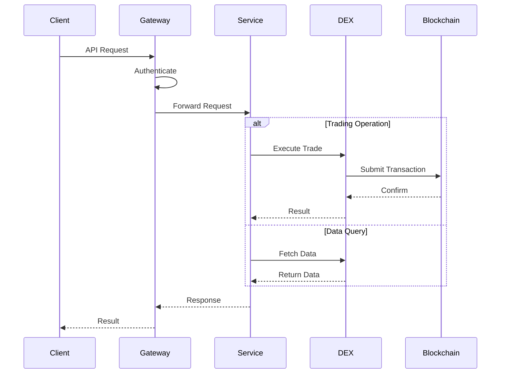

### 5.3.4 Error Handling

| Error Category | HTTP Status | Response Format | Retry Strategy |
|----------------|-------------|-----------------|----------------|
| Authentication | 401, 403 | JSON error object | No retry |
| Rate Limiting | 429 | JSON with retry-after | Exponential backoff |
| Validation | 400 | JSON with field errors | No retry |
| System Error | 500 | JSON error object | 3 retries |
| Network Error | 503 | JSON error object | Circuit breaker |

# 6. USER INTERFACE DESIGN

## 6.1 Layout Structure

The trading dashboard follows a dark theme optimized for trading with a three-panel layout:

```
+----------------------------------------------------------------------------------------------------------+
|                                     [#] AI Trading Bot Dashboard [@]                                        |
+------------------+-----------------------------------------------------+----------------------------------+
|                  |                                                     |                                  |
| NAVIGATION       |                 MAIN CONTENT                        |         MONITORING PANEL         |
|                  |                                                     |                                  |
| [#] Dashboard    |  +-----------------------------------------------+ |  +------------------------------+|
| [$] Portfolio    |  |                Price Chart                     | |  |      Portfolio Balance       ||
| [*] Strategies   |  |     [TradingView Integration Component]       | |  |          $50,000 USDC       ||
| [!] Alerts       |  |                                               | |  |    [====] +2.5% Today        ||
| [=] Settings     |  +-----------------------------------------------+ |  +------------------------------+|
|                  |                                                     |                                  |
|                  |  +-------------------+  +---------------------+     |  +------------------------------+|
|                  |  |   Active Orders   |  |    Position Size   |     |  |      Active Strategies       ||
|                  |  |                   |  |                     |     |  | [v] Grid Trading            ||
|                  |  | SOL/USDC  [x]    |  |  Risk Level: 25%   |     |  | [v] Arbitrage              ||
|                  |  | ORCA/USDC [x]    |  |  [===========]     |     |  | [v] Trend Following         ||
|                  |  +-------------------+  +---------------------+     |  +------------------------------+|
|                  |                                                     |                                  |
+------------------+-----------------------------------------------------+----------------------------------+
|                              [!] System Status: Online [====]                                             |
+----------------------------------------------------------------------------------------------------------+
```

## 6.2 Component Legend

| Symbol | Meaning |
|--------|---------|
| [#] | Dashboard/Menu icon |
| [@] | User profile/Wallet |
| [$] | Financial information |
| [*] | Favorite/Active strategies |
| [!] | Alerts/System status |
| [=] | Settings menu |
| [x] | Close/Cancel order |
| [v] | Dropdown menu |
| [====] | Progress/Status bar |

## 6.3 Key Interfaces

### 6.3.1 Portfolio View

```
+----------------------------------------------------------------------------------------------------------+
|                                     [$] Portfolio Overview                                                  |
+----------------------------------------------------------------------------------------------------------+
|  Total Balance: $50,000 USDC                                            24h Change: +2.5% [====]           |
|                                                                                                            |
|  +----------------------------------------------------------------------------------------+              |
|  |  Asset Distribution                                                                     |              |
|  |  [Chart Component]                                                                      |              |
|  |  SOL: 35% | ORCA: 25% | RAY: 20% | USDC: 20%                                          |              |
|  +----------------------------------------------------------------------------------------+              |
|                                                                                                            |
|  Active Positions                                                                                         |
|  +-------------------+--------------------+-------------------+------------------+--------------------+     |
|  | Pair    | Amount  | Entry Price       | Current Price    | P/L             | Actions            |     |
|  +-------------------+--------------------+-------------------+------------------+--------------------+     |
|  | SOL/USDC| 100 SOL | $22.50           | $23.10           | +2.67%          | [x] Close          |     |
|  | ORCA/USD| 500 ORCA| $1.20            | $1.25            | +4.17%          | [x] Close          |     |
|  +-------------------+--------------------+-------------------+------------------+--------------------+     |
+----------------------------------------------------------------------------------------------------------+
```

### 6.3.2 Strategy Configuration

```
+----------------------------------------------------------------------------------------------------------+
|                                     [*] Strategy Settings                                                   |
+----------------------------------------------------------------------------------------------------------+
|  Strategy Type: [v] Grid Trading                                                                           |
|                                                                                                            |
|  Risk Parameters                                                                                           |
|  +----------------------------------------------------------------------------------------+              |
|  |  Maximum Position Size: [...] 5%                                                        |              |
|  |  Stop Loss: [...] 2%                                                                    |              |
|  |  Take Profit: [...] 5%                                                                  |              |
|  |  Grid Levels: [...] 10                                                                  |              |
|  +----------------------------------------------------------------------------------------+              |
|                                                                                                            |
|  Trading Pairs                                                                                            |
|  ( ) All Available Pairs                                                                                  |
|  (•) Selected Pairs:                                                                                      |
|  [x] SOL/USDC                                                                                             |
|  [x] ORCA/USDC                                                                                            |
|  [x] RAY/USDC                                                                                             |
|                                                                                                            |
|  [Save Settings]                    [Test Strategy]                    [Deploy Strategy]                   |
+----------------------------------------------------------------------------------------------------------+
```

## 6.4 Responsive Behavior

The interface is optimized for desktop viewing with minimum resolution of 1920x1080px. Layout adjusts through the following breakpoints:

| Breakpoint | Layout Adjustment |
|------------|------------------|
| > 2560px | Three-panel expanded view with larger charts |
| 1920px - 2560px | Standard three-panel layout |
| 1440px - 1919px | Condensed three-panel layout |
| < 1440px | Not supported - Display warning message |

## 6.5 Interaction States

| Component | States |
|-----------|--------|
| Buttons | Default, Hover, Active, Disabled |
| Charts | Loading, Active, Error, Empty |
| Alerts | Info, Warning, Error, Success |
| Inputs | Default, Focus, Error, Disabled |
| Dropdowns | Closed, Open, Selected, Disabled |

## 6.6 Theme Specifications

| Element | Color (Dark Theme) |
|---------|-------------------|
| Background | #121212 |
| Panel Background | #1E1E1E |
| Text Primary | #FFFFFF |
| Text Secondary | #B3B3B3 |
| Accent Primary | #00C853 |
| Accent Secondary | #FF3D00 |
| Border | #333333 |
| Chart Grid | #2C2C2C |

# 7. SECURITY CONSIDERATIONS

## 7.1 AUTHENTICATION AND AUTHORIZATION

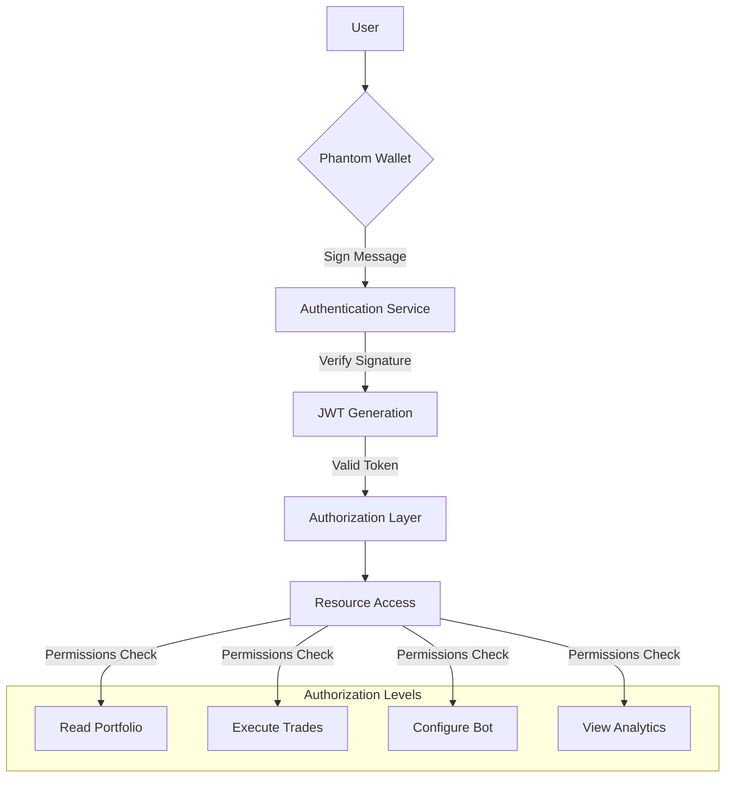

| Security Layer | Implementation | Details |
|----------------|----------------|----------|
| Authentication | Phantom Wallet | - Message signing for wallet ownership proof<br>- Nonce-based challenge-response<br>- Session expiration after 24 hours |
| Session Management | JWT + Redis | - JWT with 1-hour expiration<br>- Refresh token rotation<br>- Redis session store |
| Authorization | RBAC | - Role-based access control<br>- Granular permission system<br>- Resource-level access control |

## 7.2 DATA SECURITY

### 7.2.1 Data Encryption

| Data Type | Encryption Method | Key Management |
|-----------|------------------|----------------|
| API Keys | AES-256-GCM | AWS KMS |
| Wallet Data | AES-256-CBC | Hardware Security Module |
| Trade History | TDE (Transparent Data Encryption) | Database-level encryption |
| Network Traffic | TLS 1.3 | Certificate rotation every 90 days |

### 7.2.2 Data Protection Measures

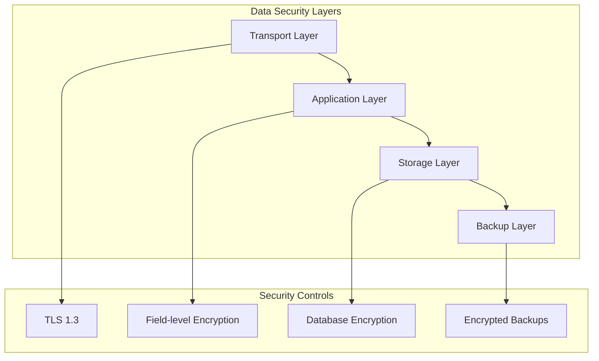

| Protection Layer | Implementation | Purpose |
|-----------------|----------------|----------|
| Transport Security | TLS 1.3 | Secure data in transit |
| Application Security | Field-level encryption | Protect sensitive data fields |
| Storage Security | AWS KMS | Secure data at rest |
| Backup Security | S3 encryption | Protect backup data |

## 7.3 SECURITY PROTOCOLS

### 7.3.1 Access Control

| Component | Security Measure | Implementation |
|-----------|-----------------|----------------|
| API Gateway | Rate limiting | - 1000 requests/min per IP<br>- JWT validation<br>- IP whitelisting |
| Database | Network isolation | - VPC security groups<br>- Private subnets<br>- IAM authentication |
| Admin Access | MFA | - Hardware key requirement<br>- IP restriction<br>- Audit logging |

### 7.3.2 Security Monitoring

```mermaid
graph LR
    subgraph "Security Monitoring"
        A[WAF] --> B[CloudWatch]
        C[GuardDuty] --> B
        D[Security Hub] --> B
        B --> E[Alert System]
    end
    
    subgraph "Response Actions"
        E --> F[Block IP]
        E --> G[Revoke Access]
        E --> H[System Shutdown]
    end
```

| Monitoring Type | Tool | Alert Threshold |
|----------------|------|-----------------|
| Intrusion Detection | AWS GuardDuty | Real-time alerts |
| DDoS Protection | AWS Shield | Traffic analysis |
| Vulnerability Scanning | AWS Inspector | Daily scans |
| Access Monitoring | CloudTrail | Real-time logging |

### 7.3.3 Incident Response

| Phase | Actions | Responsibility |
|-------|---------|---------------|
| Detection | - Log analysis<br>- Threat identification<br>- Impact assessment | Security Team |
| Containment | - Access termination<br>- System isolation<br>- Trading suspension | DevOps Team |
| Recovery | - System restoration<br>- Data verification<br>- Service resumption | Engineering Team |
| Post-Incident | - Root cause analysis<br>- Security update<br>- Documentation update | Security Team |

### 7.3.4 Compliance Controls

| Requirement | Implementation | Validation |
|-------------|----------------|------------|
| Data Privacy | GDPR compliance | Quarterly audits |
| Financial Security | MiFID II standards | Annual certification |
| Crypto Compliance | FinCEN guidelines | Monthly reviews |
| Infrastructure Security | ISO 27001 | Semi-annual audits |

# 8. INFRASTRUCTURE

## 8.1 DEPLOYMENT ENVIRONMENT

The system will be deployed exclusively in AWS Singapore region (ap-southeast-1) to minimize latency for Solana DEX interactions.

```mermaid
graph TB
    subgraph "Production Environment"
        subgraph "AWS ap-southeast-1"
            subgraph "Availability Zone A"
                A[Application Servers]
                B[(Primary Database)]
                C[Redis Primary]
            end
            
            subgraph "Availability Zone B"
                D[Application Servers]
                E[(Database Replica)]
                F[Redis Replica]
            end
            
            G[Load Balancer]
            H[Route 53]
            I[CloudFront]
        end
    end
    
    subgraph "Disaster Recovery"
        J[Backup Region ap-east-1]
    end
    
    H --> I
    I --> G
    G --> A
    G --> D
    A --> B
    D --> E
    B --> E
```

| Environment | Purpose | Configuration |
|------------|---------|---------------|
| Production | Primary trading operations | Multi-AZ, Auto-scaling |
| Staging | Pre-production testing | Single-AZ, Limited resources |
| Development | Development and testing | Local containers, Minimal resources |
| DR | Disaster recovery | Standby in Hong Kong region |

## 8.2 CLOUD SERVICES

| Service | Purpose | Configuration |
|---------|---------|---------------|
| EC2 | Application hosting | t3.xlarge, Auto-scaling groups |
| RDS | PostgreSQL databases | db.r6g.xlarge, Multi-AZ |
| ElastiCache | Redis caching | cache.r6g.large, Cluster mode |
| CloudFront | CDN for web dashboard | Edge locations in Asia |
| Route 53 | DNS management | Latency-based routing |
| ECS | Container orchestration | Fargate launch type |
| ECR | Container registry | Private repository |
| CloudWatch | Monitoring and logging | Custom metrics, Log insights |
| KMS | Key management | Automatic key rotation |
| WAF | Web application firewall | Custom rule sets |

## 8.3 CONTAINERIZATION

```mermaid
graph TD
    subgraph "Container Architecture"
        A[Base Images] --> B[Development Images]
        B --> C[Production Images]
        
        subgraph "Service Containers"
            D[Strategy Engine]
            E[Execution Engine]
            F[Data Collector]
            G[API Gateway]
            H[Web Dashboard]
        end
        
        C --> D
        C --> E
        C --> F
        C --> G
        C --> H
    end
```

| Image | Base | Size Limit | Configuration |
|-------|------|------------|---------------|
| Strategy Engine | Python 3.11-slim | 1.2GB | ML libraries, NumPy |
| Execution Engine | Rust-slim | 400MB | Trading libraries |
| Data Collector | Rust-slim | 300MB | Network optimized |
| API Gateway | nginx-alpine | 200MB | Custom modules |
| Web Dashboard | node-alpine | 250MB | React build |

## 8.4 ORCHESTRATION

ECS with Fargate is chosen for container orchestration due to its seamless AWS integration and reduced operational overhead.

```mermaid
graph TB
    subgraph "ECS Cluster"
        A[Service Discovery]
        B[Task Definitions]
        C[Services]
        
        subgraph "Tasks"
            D[Strategy Engine Tasks]
            E[Execution Engine Tasks]
            F[Data Collector Tasks]
        end
        
        B --> C
        C --> D
        C --> E
        C --> F
        A --> C
    end
```

| Component | Configuration | Scaling Policy |
|-----------|---------------|----------------|
| ECS Cluster | FARGATE | Regional deployment |
| Service Discovery | Route 53 DNS | Auto naming |
| Task Definitions | Latest revision | Resource optimization |
| Auto Scaling | Target tracking | CPU/Memory metrics |
| Load Balancing | Application LB | Path-based routing |

## 8.5 CI/CD PIPELINE

```mermaid
graph LR
    A[GitHub Repository] --> B[GitHub Actions]
    B --> C[Build & Test]
    C --> D[Security Scan]
    D --> E[Container Build]
    E --> F[ECR Push]
    F --> G[ECS Deploy]
    
    subgraph "Environments"
        H[Development]
        I[Staging]
        J[Production]
    end
    
    G --> H
    G --> I
    G --> J
```

| Stage | Tools | Configuration |
|-------|-------|---------------|
| Source Control | GitHub | Protected branches, Required reviews |
| CI Pipeline | GitHub Actions | Matrix builds, Caching |
| Testing | PyTest, Cargo Test | Parallel execution |
| Security | Snyk, SonarQube | Fail on critical issues |
| Artifact Storage | ECR | Image scanning enabled |
| Deployment | AWS CodeDeploy | Blue-green deployment |
| Monitoring | CloudWatch | Deployment tracking |

### Deployment Strategy

| Environment | Strategy | Automation | Rollback |
|------------|----------|------------|----------|
| Development | Direct deploy | Automatic | Manual |
| Staging | Blue-green | Semi-automatic | Automatic |
| Production | Blue-green | Manual approval | Automatic |
| DR | Failover | Manual trigger | Automatic |

# APPENDICES

## A.1 ADDITIONAL TECHNICAL INFORMATION

### A.1.1 Network Topology

```mermaid
graph TB
    subgraph "Edge Network"
        A[CloudFront CDN]
        B[Route 53 DNS]
    end
    
    subgraph "Application Layer"
        C[API Gateway]
        D[Load Balancer]
        E[Web Servers]
    end
    
    subgraph "Processing Layer"
        F[Strategy Engine]
        G[Execution Engine]
        H[Data Collectors]
    end
    
    subgraph "Storage Layer"
        I[(PostgreSQL)]
        J[(TimescaleDB)]
        K[(Redis)]
    end
    
    subgraph "External Services"
        L[Jupiter DEX]
        M[Pump Fun DEX]
        N[Drift Protocol]
        O[Jito Labs]
    end
    
    A --> C
    B --> A
    C --> D
    D --> E
    D --> F
    D --> G
    D --> H
    
    F --> I
    G --> J
    H --> K
    
    F --> L
    G --> M
    H --> N
    G --> O
```

### A.1.2 Performance Metrics

| Metric | Target | Monitoring Method |
|--------|--------|------------------|
| Trade Execution Latency | < 500ms | Prometheus histograms |
| Strategy Optimization Cycle | 5 minutes | Custom metrics |
| Portfolio Rebalancing Time | < 30 seconds | System logs |
| ML Model Update Frequency | 1 hour | Training metrics |
| Data Collection Lag | < 100ms | Latency tracking |

## A.2 GLOSSARY

| Term | Definition |
|------|------------|
| Arbitrage | Trading strategy that exploits price differences between markets |
| Backrun | MEV strategy that involves placing orders immediately after another transaction |
| Circuit Breaker | Automated system shutdown mechanism triggered by predefined conditions |
| Grid Trading | Strategy that places buy and sell orders at predetermined intervals |
| Hypertable | TimescaleDB's distributed table structure for time-series data |
| Liquidity Pool | Smart contract containing token pairs for DEX trading |
| Order Book | List of buy and sell orders for an asset, organized by price |
| Position | Open trading commitment in a specific trading pair |
| Reinforcement Learning | Machine learning approach that learns optimal actions through trial and error |
| Smart Order Routing | Automated system for finding the best execution path across multiple DEXs |
| Time-Series Data | Data points indexed in time order |
| Wallet Address | Unique identifier for a cryptocurrency wallet on the blockchain |

## A.3 ACRONYMS

| Acronym | Full Form |
|---------|-----------|
| ACID | Atomicity, Consistency, Isolation, Durability |
| ALB | Application Load Balancer |
| AZ | Availability Zone |
| CDN | Content Delivery Network |
| CQRS | Command Query Responsibility Segregation |
| DDoS | Distributed Denial of Service |
| DEX | Decentralized Exchange |
| DNS | Domain Name System |
| ECS | Elastic Container Service |
| ECR | Elastic Container Registry |
| ELK | Elasticsearch, Logstash, Kibana |
| FIPS | Federal Information Processing Standards |
| GDPR | General Data Protection Regulation |
| HSM | Hardware Security Module |
| IOPS | Input/Output Operations Per Second |
| JWT | JSON Web Token |
| KMS | Key Management Service |
| MEV | Maximal Extractable Value |
| MFA | Multi-Factor Authentication |
| ML | Machine Learning |
| P/L | Profit/Loss |
| RPC | Remote Procedure Call |
| SDK | Software Development Kit |
| SSL | Secure Sockets Layer |
| TDE | Transparent Data Encryption |
| TLS | Transport Layer Security |
| TTL | Time To Live |
| UI | User Interface |
| VPC | Virtual Private Cloud |
| WAF | Web Application Firewall |
| WSS | WebSocket Secure |

## A.4 REFERENCES

| Category | Resource | URL/Location |
|----------|----------|--------------|
| Blockchain | Solana Documentation | https://docs.solana.com |
| DEX Integration | Jupiter API Reference | https://docs.jup.ag |
| Infrastructure | AWS Best Practices | https://aws.amazon.com/architecture |
| Security | OWASP Security Guidelines | https://owasp.org/standards |
| Development | Rust Programming Guide | https://doc.rust-lang.org |
| ML/AI | PyTorch Documentation | https://pytorch.org/docs |
| Database | TimescaleDB Tutorials | https://docs.timescale.com |
| Monitoring | Prometheus Documentation | https://prometheus.io/docs |